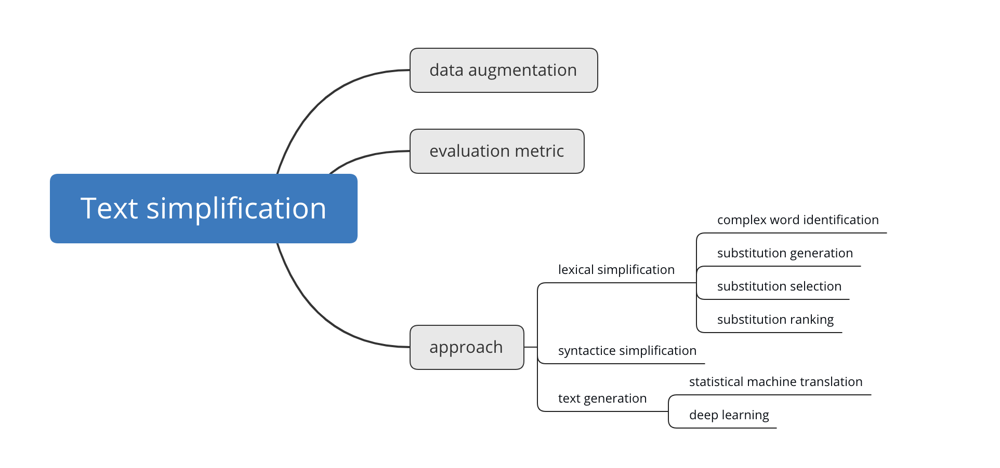

# Text Simplification Paper

This repo contains a list of paper related to the topic of text simplification.

Text simplification is the process of reducing the linguistic complexity of a text,while still retaining the oroginal information and meaning. There are  three main research directions currently. First, Few datasets are available in this field.In order to get more data,we need **data augmentation**. Second,We need to establish scientific and practical **evaluation metric** for this task. Third,the **approach** to do text simplification is important obviously. There are three approach to do text simplification:**Lexical simplification**,**syntactice simplification** and **text generation**.

The following is a list of related papers,If any error, please open an issue.

---

## Survey

**A Survey on Text Simplification** arXiv2020  [pdf](https://arxiv.org/pdf/2008.08612.pdf)

**Data-Driven Sentence Simplification: Survey and Benchmark** arXiv2020  [pdf](https://www.mitpressjournals.org/doi/pdf/10.1162/coli_a_00370)

**A Survey of Automated Text Simplification**  IJACSA2014  [pdf](https://thesai.org/Downloads/SpecialIssueNo9/Paper_9-A_Survey_of_Automated_Text_Simplification.pdf)

---

## data augmentation

**ASSET: A Dataset for Tuning and Evaluation of Sentence Simplification Models with Multiple Rewriting Transformations** ACL2020 [pdf](https://arxiv.org/pdf/2005.00481.pdf)

**Neural CRF Model for Sentence Alignment in Text Simplification** ACL2020 [pdf](https://www.aclweb.org/anthology/2020.acl-main.709.pdf)

**Neural Text Simplification in Low-Resource Conditions Using Weak Supervision**  ACL2019 [pdf](https://www.aclweb.org/anthology/W19-2305/)

**Text Simplification from Professionally Produced Corpora**  ACL2018 [pdf](https://www.aclweb.org/anthology/L18-1553/)

**CATS: A Tool for Customized Alignment of Text Simplification Corpora**  ACL2018 [pdf](https://www.aclweb.org/anthology/L18-1615/)

**Sentence Alignment Methods for Improving Text Simplification Systems**  ACL2017 [pdf](https://www.aclweb.org/anthology/P17-2016.pdf)

**Semantic Features Based on Word Alignments for Estimating Quality of Text Simplification**   ACL2017 [pdf](https://www.aclweb.org/anthology/I17-2019/)

---

## evaluation metric

**EASSE: Easier Automatic Sentence Simplification Evaluation** EMNLP2019 [pdf](https://www.aclweb.org/anthology/D19-3009/)

**BLEU is Not Suitable for the Evaluation of Text Simplification** EMNLP2018 [pdf](https://www.aclweb.org/anthology/D18-1081/)

**Simple and Effective Text Simplification Using Semantic and Neural Methods** ACL2018 [pdf](https://www.aclweb.org/anthology/P18-1016/)

**Benchmarking Lexical Simplification Systems** ACL2016 [pdf](https://www.aclweb.org/anthology/L16-1491/)

**Optimizing Statistical Machine Translation for Text Simplification** TACL2016  [pdf](https://www.aclweb.org/anthology/Q16-1029/)

---

## lexical simplification

**Recursive Context-Aware Lexical Simplification** EMNLP2019 [pdf](https://www.aclweb.org/anthology/D19-1491/)

**A Word-Complexity Lexicon and A Neural Readability Ranking Model for Lexical Simplification** EMNLP2018 [pdf](https://www.aclweb.org/anthology/D18-1410/)

**Simplification Using Paraphrases and Context-based Lexical Substitution** ACL2018 [pdf](https://www.aclweb.org/anthology/N18-1019/)

**SV000gg at SemEval-2016 Task 11: Heavy Gauge Complex Word Identification with System Voting** ACL2016 [pdf](https://www.aclweb.org/anthology/S16-1149/)

**PLUJAGH at SemEval-2016 Task 11: Simple System for Complex Word Identification** ACL2016 [pdf](https://www.aclweb.org/anthology/S16-1146/)

**A Simple Word Embedding Model for Lexical Substitution**  ACL2015 [pdf](https://www.aclweb.org/anthology/W15-1501/)

**Simplifying Lexical Simplification: Do We Need Simplified Corpora?**  ACL2015 [pdf](https://www.aclweb.org/anthology/P15-2011/)

**LEXenstein: A Framework for Lexical Simplification** ACL2015 [pdf](https://www.aclweb.org/anthology/P15-4015/)

**Selecting Proper Lexical Paraphrase for Children** ACL2013 [pdf](https://www.aclweb.org/anthology/O13-1007/)

**UOW-SHEF: SimpLex – Lexical Simplicity Ranking based on Contextual and Psycholinguistic Features** ACL2012 [pdf](https://www.aclweb.org/anthology/S12-1066/)

**Putting it Simply: a Context-Aware Approach to Lexical Simplification** ACL2011 [pdf](https://www.aclweb.org/anthology/P11-2087/)

**Mining a Lexicon of Technical Terms and Lay Equivalents**   ACL2007 [pdf](https://www.aclweb.org/anthology/W07-1007/)

---

## syntactice simplification

**Simple, readable sub-sentences** ACL2013 [pdf](https://www.aclweb.org/anthology/P13-3021/)

---

## text generation

### statistical machine translation

**Learning to Simplify Sentences Using Wikipedia**  arXiv2011  [pdf](https://www.aclweb.org/anthology/W11-1601/)

---

### deep learning

**Iterative Edit-Based Unsupervised Sentence Simplification** ACL2020 [pdf](https://www.aclweb.org/anthology/2020.acl-main.707/)

**Controllable Text Simplification with Lexical Constraint Loss** ACL2019 [pdf](https://www.aclweb.org/anthology/P19-2036/)

**EditNTS: An Neural Programmer-Interpreter Model for Sentence Simplification through Explicit Editing** ACL2019 [pdf](https://www.aclweb.org/anthology/P19-1331/)

**Integrating Transformer and Paraphrase Rules for Sentence Simplification** EMNLP2018 [pdf](https://www.aclweb.org/anthology/D18-1355/)

 **A Detailed Evaluation of Neural Sequence-to-Sequence Models for In-domain and Cross-domain Text Simplification**  ACL2018 [pdf](https://www.aclweb.org/anthology/L18-1479/)

**Learning Simplifications for Specific Target Audiences**   ACL2018 [pdf](https://www.aclweb.org/anthology/P18-2113/)

**Simple and Effective Text Simplification Using Semantic and Neural Methods** ACL2018 [pdf](https://www.aclweb.org/anthology/P18-1016/)

**Text Simplification as Tree Labeling** ACL2016 [pdf](https://www.aclweb.org/anthology/P16-2055/)

---

### unsupervised learning

**Unsupervised Neural Text Simplification** ACL2019 [pdf](https://www.aclweb.org/anthology/P19-1198/)

**Exploring Neural Text Simplification Models**  ACL2017 [pdf](https://www.aclweb.org/anthology/P17-2014.pdf)

---

### Reinforcement Learning

**Sentence Simplification with Deep Reinforcement Learning**  EMNLP2017 [pdf](https://www.aclweb.org/anthology/D17-1062/)

---

## Analysis

**Metaphors in Text Simplification:To change or not to change, that is the question**  ACL2019 [pdf](https://www.aclweb.org/anthology/W19-4444/)

---

## Application

**Neural Text Simplification of Clinical Letters with a Domain Specific Phrase Table**  ACL2019 [pdf](https://www.aclweb.org/anthology/P19-1037/)

**Lexi: A tool for adaptive, personalized text simplification** ACL2018 [pdf](https://www.aclweb.org/anthology/C18-1021/)

**Simple PPDB: A Paraphrase Database for Simplification** ACL2016 [pdf](https://www.aclweb.org/anthology/P16-2024/)

